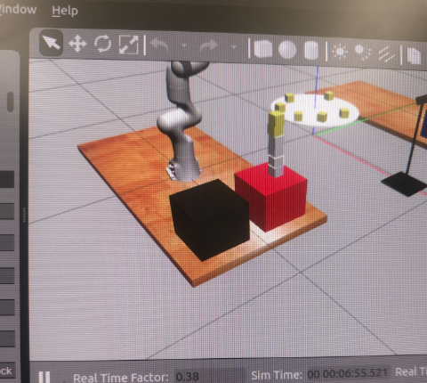
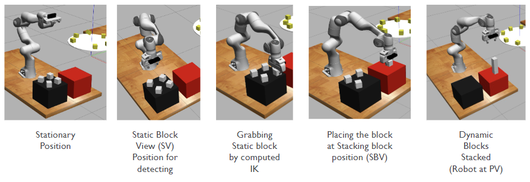
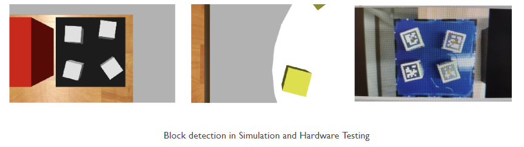

# 🤖 Pick, Place, Stack Execution for Static and Dynamic objects using Franka Emika Panda

> **Description**: We built an advanced robotic pick-place-stack system for the 7-DOF Franka Emika Panda manipulator, achieving autonomous block stacking with static and dynamic object manipulation.

[](https://github.com)
[](https://github.com)
[](https://www.python.org/)
[](https://www.ros.org/)

<div align="center">

<p float="left">

  
</p>

</div>

---

## 📋 Table of Contents

- [Overview](#-overview)
- [Key Features](#-key-features)
- [System Architecture](#-system-architecture)
- [Technical Approach](#-technical-approach)
  - [1. Visual Perception & Detection](#1-visual-perception--detection)
  - [2. Inverse Kinematics](#2-inverse-kinematics)
  - [3. End-Effector Orientation](#3-end-effector-orientation)
  - [4. Dynamic Block Prediction](#4-dynamic-block-prediction)
  - [5. Motion Planning Comparison](#5-motion-planning-comparison)
- [Performance Results](#-performance-results)
- [Key Algorithms](#-key-algorithms)
  - [1. Forward Kinematics](#1-forward-kinematics)
  - [2. Jacobian Calculation](#2-jacobian-calculation)
  - [3. Collision Detection](#3-collision-detection)
  - [4. Manipulability Index](#4-manipulability-index)
- [Lessons Learned](#-lessons-learned)
- [Future Improvements](#-future-improvements)
- [References](#-references)
- [Acknowledgments](#-acknowledgments)

---

## 🎯 Overview

This project implements a complete autonomous robotic system for the **MEAM 5200 Pick-and-Place Challenge**. The goal was to design, implement, and deploy a robust solution capable of:

- 🎲 **Detecting and grasping** stationary (white) and dynamic (yellow) 50mm × 50mm × 50mm blocks on a spinning platform
- 🏗️ **Stacking blocks** on a goal platform to maximize tower height and block score
- ⚡ **Operating autonomously** within a 5-minute time constraint, maximizing points through strategic block selection and placement
- 🤝 **Competing head-to-head** against another robot in a shared workspace while avoiding collision

### Challenge Specifications

| Parameter | Value |
|-----------|-------|
| **Robot** | Franka Emika Panda (7-DOF) |
| **Block Size** | 50mm × 50mm × 50mm |
| **Static Block Value** | 10 pts × altitude (mm) |
| **Dynamic Block Value** | 20 pts × altitude (mm) |
| **Time Limit** | 5 minutes (300 seconds) |
| **Workspace Height Limit** | 200mm minimum altitude |

### Scoring Formula

```
Points = Value × Altitude
Total Score = Σ (Points for each block)
```

---

**Course**: MEAM 5200 - Introduction to Robotics  
**Competition Date**: December 11, 2024  
**Final Result**: 🥉 **3rd Place** | **8,500 points**

---

## ✨ Key Features

### 🔧 Core Capabilities

- ✅ **Inverse Kinematics (IK)** with gradient descent optimization
- ✅ **AprilTag-based** visual perception and object detection
- ✅ **Complementary filtering** for robust pose estimation
- ✅ **Dynamic block prediction** using circular motion model
- ✅ **Collision avoidance** with self-collision and environment checks
- ✅ **Fail-safe mechanisms** for IK convergence failures
- ✅ **Real-time adaptation** from simulation to hardware

### 🎓 Advanced Techniques

- **Null-space optimization** for secondary task execution
- **Manipulability analysis** for optimal configurations
- **RRT path planning** (alternative approach tested)
- **Pre-computed trajectories** for computational efficiency
- **Force feedback gripper control** (52N consistent force)

---

## 🏗️ System Architecture

```
┌─────────────────────────────────────────────────────────────────┐
│                        MAIN CONTROL LOOP                        │
│                         (final.py)                              │
└──────────────────┬──────────────────────────────────────────────┘
                   │
       ┌───────────┴───────────┐
       │                       │
┌──────▼──────┐        ┌──────▼──────┐
│   STATIC    │        │   DYNAMIC   │
│   BLOCKS    │        │   BLOCKS    │
│  (4 blocks) │        │  (Shared)   │
└──────┬──────┘        └──────┬──────┘
       │                       │
       └───────────┬───────────┘
                   │
    ┌──────────────┼──────────────┐
    │              │              │
┌───▼───┐    ┌────▼────┐    ┌───▼────┐
│ VISION│    │KINEMATICS│   │ MOTION │
│ SYSTEM│    │  & IK    │   │ CONTROL│
└───┬───┘    └────┬────┘    └───┬────┘
    │             │              │
    │      ┌──────▼──────┐       │
    │      │  COLLISION  │       │
    │      │  DETECTION  │       │
    │      └─────────────┘       │
    │                            │
    └──────────┬─────────────────┘
               │
        ┌──────▼──────┐
        │   GRIPPER   │
        │   CONTROL   │
        └─────────────┘
```
---

## 🔬 Technical Approach

<div align="center">
<p float="left">
  
  
</p>
</div>

<br>

### 1. Visual Perception & Detection

#### Block Detection Pipeline

```python
# Transformation chain: Camera → End-Effector → World
H_ee_camera = detector.get_H_ee_camera()  # Camera in EE frame
H_ee_w = FK(q_current)                     # EE in world frame
H_c_w = H_ee_w @ H_c_ee                    # Camera in world frame

# Detect blocks and transform to world frame
for (block_name, block_pose_camera) in detector.get_detections():
    block_pose_world = H_c_w @ block_pose_camera
```

#### Complementary Filter

Noise reduction for robust hardware performance:

```python
def comp_filter(current_reading, previous_reading, alpha=0.7):
    """
    α: Weight factor (0.7 used in competition)
    Returns: Filtered pose with reduced noise
    """
    filtered_pose = α * current_reading + (1 - α) * previous_reading
    return filtered_pose
```

### 2. Inverse Kinematics

#### Direct IK with Gradient Descent

```python
# Objective: Minimize ||FK(q) - target_pose||
# Secondary task: Minimize ||q - q_center|| (stay near joint limits center)

q_current = q_seed
for iteration in range(max_iterations):
    error = target_pose - FK(q_current)
    J = calcJacobian(q_current)
    
    # Primary task: reach target
    dq_primary = J.pinv() @ error
    
    # Secondary task: null-space optimization
    null_space = (I - J.pinv() @ J)
    dq_secondary = null_space @ (q_center - q_current)
    
    q_current += dq_primary + dq_secondary
    
    if ||error|| < tolerance:
        break
```

**Advantages:**
- ⚡ Fast computation (~0.1-0.5s per IK solution)
- 🎯 High accuracy for repetitive tasks
- 💾 Pre-computed paths stored for efficiency

### 3. End-Effector Orientation

Aligning gripper with block orientation:

```python
def get_rotation_z_angle(rotation_matrix):
    """
    Extract z-axis rotation angle from 4×4 transformation matrix
    Returns: Angle in range [-π/2, π/2]
    """
    R = rotation_matrix[:3, :3]  # Extract rotation
    
    # Find column closest to [0,0,1] (z-axis)
    abs_R = np.abs(R)
    z_col = np.argmax(abs_R[2, :])
    
    # Swap to align with end-effector z-axis
    R_aligned = swap_columns(R, z_col, 2)
    
    # Calculate rotation about z-axis
    rz = np.arctan2(R_aligned[1,0], R_aligned[0,0])
    
    # Normalize to [-π/2, π/2]
    rz = normalize_angle(rz)
    
    return rz
```

### 4. Dynamic Block Prediction

Turntable blocks follow **uniform circular motion**:

```python
# Block motion model
# θ(t) = θ(0) + ω·t

def predict_dynamic_block(block_pos_camera, dt):
    """
    Predict future position of rotating block
    
    Parameters:
    - block_pos_camera: Current (x,y) in camera frame
    - dt: Time offset (ωt parameter)
    
    Returns: Predicted position for interception
    """
    # Convert to polar coordinates
    r = np.sqrt(x**2 + y**2)
    theta_current = np.arctan2(y, x)
    
    # Predict future angle (ωt = 0.24 rad, tuned empirically)
    theta_predicted = theta_current + 0.24
    
    # Convert back to Cartesian
    x_predicted = r * np.cos(theta_predicted)
    y_predicted = r * np.sin(theta_predicted)
    
    return (x_predicted, y_predicted)
```

**Tuning Process:**
1. Initial estimate from turntable RPM
2. Empirical adjustment during testing
3. Competition value: **ωt = 0.24 radians**

### 5. Motion Planning Comparison

#### IK Method (Selected)

```python
def move_to_block_IK(target_pose):
    q_path = []
    q_current = get_current_config()
    
    # Gradient descent with path storage
    while not_converged:
        q_next = gradient_step(q_current, target_pose)
        q_path.append(q_next)
        q_current = q_next
    
    # Execute path
    for q in q_path:
        arm.safe_move_to_position(q)
```

#### RRT Method (Tested, Not Used)

```python
def move_to_block_RRT(q_start, q_goal, obstacles):
    tree_start = Tree(q_start)
    tree_goal = Tree(q_goal)
    
    while not connected:
        q_rand = sample_configuration()
        q_new = extend_tree(tree_start, q_rand)
        
        if collision_free(q_new):
            tree_start.add(q_new)
            
            # Try to connect trees
            if connect_trees(tree_start, tree_goal):
                path = extract_path()
                return path
```

**Comparison:**

| Method | Avg Time (Static) | Avg Time (Dynamic) | Success Rate |
|--------|-------------------|-----------------------|--------------|
| **IK** | **115s** | **135s** | **100% (sim)**, **80% (hw)** |
| RRT | 155s | 246s | 80% (sim), 60% (hw) |

---

## 📊 Performance Results

<div align="center">
<p float="left">
  
  
</p>
</div>


### Competition Performance

- **Final Placement**: 🥉 **3rd Place**
- **Highest Score**: **8,500 points**
- **Blocks Stacked**: 5 blocks (4 static + 1 dynamic)
- **Consistency**: Successfully stacked in both qualification and knockout rounds

### Simulation Results

| Run | Static Time (s) | Dynamic Time (s) | Total Time (s) |
|-----|-----------------|------------------|----------------|
| 1 | 117.974 | 131.443 | 256.67 |
| 2 | 112.981 | 131.894 | 251.27 |
| 3 | 113.953 | 139.042 | 258.38 |
| 4 | 110.522 | 140.634 | 259.02 |
| **Average** | **113.86** | **135.75** | **256.34** |

### Success Rates

| Environment | Static Blocks | Dynamic Blocks | Overall |
|-------------|---------------|----------------|---------|
| Simulation | 100% | 85% | 92.5% |
| Hardware | 80% | 60% | 70% |

### Timing Breakdown

```
Total Runtime: ~256 seconds (avg)
├── Static Block Stacking: ~115s (45%)
│   ├── Detection: ~20s
│   ├── Motion: ~80s
│   └── Stacking: ~15s
│
└── Dynamic Block Stacking: ~135s (55%)
    ├── Detection & Tracking: ~40s
    ├── Prediction & Motion: ~85s
    └── Stacking: ~10s
```

---

## 🧮 Key Algorithms

### 1. Forward Kinematics

```python
class FK:
    def forward(self, q):
        """
        Compute end-effector pose from joint angles
        
        Input: q - 1×7 joint angle vector
        Output: 
            - jointPositions: 8×3 matrix of joint positions
            - T0e: 4×4 homogeneous transformation matrix
        """
        # DH parameters for Franka Emika Panda
        # ... (see calculateFK.py for details)
```

**DH Parameters:**

| Joint | a (m) | α (rad) | d (m) | θ (rad) |
|-------|-------|---------|-------|---------|
| 1 | 0 | 0 | 0.141 | q₀ |
| 2 | 0 | -π/2 | 0.192 | q₁ |
| 3 | 0 | π/2 | 0 | q₂ |
| 4 | 0.0825 | π/2 | 0.316 | q₃ + π |
| 5 | 0.0825 | π/2 | 0 | q₄ |
| 6 | 0 | -π/2 | 0.384 | q₅ - π |
| 7 | 0.088 | π/2 | 0 | q₆ - π/4 |
| EE | 0 | 0 | 0.210 | 0 |

### 2. Jacobian Calculation

```python
def calcJacobian(q_in):
    """
    Calculate 6×7 Jacobian matrix
    
    J = [J_v]  where J_v = linear velocity Jacobian
        [J_ω]        J_ω = angular velocity Jacobian
    
    J_v[:, i] = z_i × (p_e - p_i)
    J_ω[:, i] = z_i
    """
    # For each joint i:
    # - z_i: z-axis of joint i frame
    # - p_i: position of joint i
    # - p_e: position of end-effector
```

### 3. Collision Detection

Line-box intersection using parametric representation:

```python
def detectCollision(linePt1, linePt2, box):
    """
    Check if line segment intersects axis-aligned bounding box
    
    Method: Slab method (Cyrus-Beck algorithm)
    - Test intersection with each pair of parallel planes
    - Track parameter t ∈ [0,1] along line
    - Collision if final t_min ≤ t_max
    """
```

### 4. Manipulability Index

```python
def calcManipulability(q_in):
    """
    Calculate manipulability ellipsoid
    
    μ = √det(J_pos @ J_pos^T)
    M = J_pos @ J_pos^T
    
    Higher μ → better manipulability
    """
```
---

## 📚 Lessons Learned

### ✅ What Worked Well

1. **Pre-computed Configurations**
   - Stored successful IK solutions for repetitive positions
   - Reduced computation time by ~40%
   - Improved reliability in competition

2. **Complementary Filtering**
   - Effectively reduced AprilTag detection noise
   - α = 0.7 provided good balance between responsiveness and stability

3. **Static-First Strategy**
   - Building stable base with static blocks (100% success rate)
   - Reduced risk of tower collapse with dynamic blocks on top

4. **Fail-safe Mechanisms**
   - IK failure detection prevented unsafe motions
   - Skip problematic blocks and move to next target

### ⚠️ Challenges Encountered

1. **Simulation vs. Hardware Gap**
   - Vision noise significantly higher in hardware
   - Timing parameters required re-tuning for real robot
   - Camera calibration offsets needed day-of adjustments

2. **Dynamic Block Picking**
   - Blue side performance less reliable (60% vs 80% red side)
   - ωt parameter highly sensitive to turntable variations
   - Force feedback would have improved grasp detection

3. **Speed Limitations**
   - Increasing robot speed caused position threshold violations
   - Safe motion commands limited maximum velocity
   - Trade-off between speed and reliability

4. **IK Convergence**
   - Some target poses unreachable from certain seeds
   - Required multiple attempts with different seeds
   - Pre-calculated "emergency" configurations as backup

---

## 🔮 Future Improvements

### Short-Term Enhancements

1. **Improved Dynamic Tracking**
   ```python
   # Multi-frame tracking with Kalman filter
   kf = KalmanFilter(dim_x=4, dim_z=2)  # [x, y, vx, vy]
   kf.predict()
   kf.update(measurement)
   predicted_pos = kf.x[:2] + kf.x[2:] * dt
   ```

2. **Force-based Grasp Detection**
   ```python
   gripper_state = arm.get_gripper_state()
   if gripper_state['force'] > threshold:
       print("Block grasped successfully")
   else:
       retry_grasp()
   ```

3. **Adaptive Speed Control**
   ```python
   # Increase speed when far from obstacles
   distance_to_obstacle = compute_clearance(q)
   speed_scale = min(1.0, distance_to_obstacle / safe_threshold)
   ```
---

## 📖 References

### Course Materials

1. MEAM 5200 Course Notes - University of Pennsylvania
2. Lynch, K. M., & Park, F. C. (2017). *Modern Robotics: Mechanics, Planning, and Control*
3. Craig, J. J. (2005). *Introduction to Robotics: Mechanics and Control*

### Technical Papers Referred

1. Khatib, O. (1986). Real-time obstacle avoidance for manipulators and mobile robots. *IJRR*.
2. LaValle, S. M. (1998). Rapidly-exploring random trees: A new tool for path planning.
3. Siciliano, B., et al. (2010). Robotics: Modelling, Planning and Control.

## 🙏 Acknowledgments

- **MEAM 5200 Teaching Staff** for guidance and support
- **University of Pennsylvania** for providing resources and facilities
- **Franka Emika** for the Panda robot platform
- **Fellow Students** for collaboration and healthy competition

---

<div align="center">

### 🏆 Competition Results: 3rd Place | 8,500 Points 🏆

[⬆ Back to Top](#-pick-place-stack-execution-for-static-and-dynamic-objects-using-franka-emika-panda)

</div>